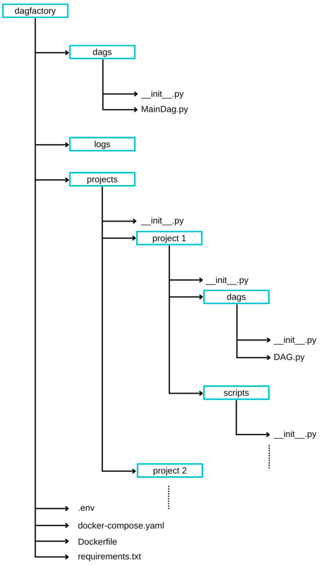
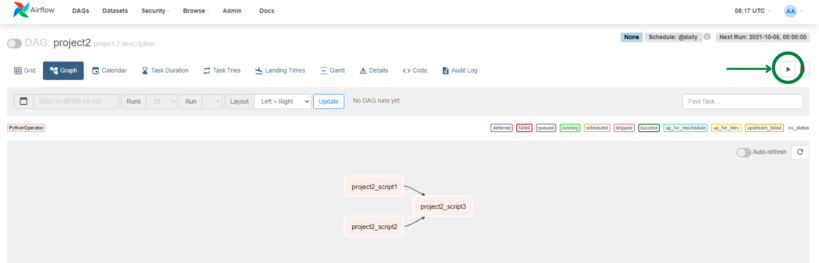
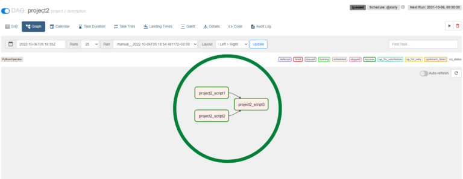

# dagfactory
#### SmartMaple altında yazılan tüm Airflow DAG projeleri için oluşturulmuş dagfactory reposudur. Bu repo ile bütün DAG projeleri kontrol edilebilir.

## Airflow Nedir?
Apache Airflow, programlı bir şekilde iş akışlarını ve büyük veri setlerinin hazırlanmasını, işlenmesi süreçlerini ve loglanmasını sağlar. Tüm bu süreçler Airflow'un oluşturduğu webserver'da kontrol edilebilir.

## Neden Airflow?
Yazılan tüm projelerin otomatik olarak belirlenen gün ve saatlerde çalışmasına olanak sağlar. Böylece projelerin manuel kontrolü olabildiğince azaltılmış olur. Projelerin tüm logları ve durumları takip edilebilir. 

## DAG (Directed Acyclic Graph) Nedir?
DAG, Airflow'un temel konseptidir. Proje içerisindeki tüm görevleri bir araya toplar ve bu görevlerin organizasyonunu ve birbirleri arasındaki ilişkilerini kontrol ederek projenin nasıl çalışması gerektiğini belirler.

## dagfactory Path Yapısı

#### Mavi dikdörtgen içerisindekiler klasör, diğerleri python script dosyalarıdır.
dagfactory genel yol yapısı yukarıdaki gibidir. dagfactory için yazılan projeler bu yapıya uygun olmalıdır. Dikkat edilmesi gerekenler:
  * dagfactory repo için herhangi bir DAG projesi yazılırken ana dosya yapısı değiştirilmemelidir. Yazılan tüm DAG projeleri ```projects``` klasörü altında toplanır ve projeler figürde görüldüğü üzere ```project1``` klasörü yapısında olduğu gibi tasarlanmalıdır.
  * Figürde görüldüğü üzere oluşturulan her klasör için bir **init** scripti eklenmesi gerekir,
  * **MainDag.py** scripti, eklenen diğer projeleri etkilememek adına **değiştirilmemesi** gerekmektedir,
  * Herbir proje için yazılan **DAG scriptlerinin** uzantısı ortak olarak **DAG.py** olmalıdır; çünkü MainDag.py, bu isim ile tüm projelerin dag scriptlerini çağırır,
  * **Scripts** klasörünün altında istenilen klasör ve dosya yapısı kullanılabilir; buradaki tüm script, dosya ve klasörler proje için gerekli sınıf, fonksiyon ve parametreleri içerir; bunun yanında her klasör için gerekli olan **init** scriptinin unutulmaması gerekir.
  
 ## dagfactory Run
 #### dagfactory reposunu çalıştırabilmek için docker ve docker-compose sistemde kurulu olması gerekmektedir. 
  * [docker](https://docs.docker.com/engine/install/) 
  * [docker-compose](https://docs.docker.com/compose/install/)
  
Yukarıda gösterilen linklerden docker ve docker-compose kurulumlarını yapabilirsiniz. Aşağıda bash komutları gösterilmiştir. Komutları çalıştırmadan önce docker'ın çalıştığından emin olun.

```diff
git clone --recurse-submodules https://github.com/smartmaple/airflow.git
cd airflow
docker-compose up airflow-init
docker-compose up
```
Komutlar hatasız bir şekilde çalıştıysa ```http://127.0.0.1:8080``` portunda airflow webserver'e bağlanıp DAGlar çalıştırılabilir.

## Projeler
Projeler oluşturulurken dags klasörü ve içerisinde DAG.py scripti olmalıdır. Projelerin DAG yönetimleri ayrı ayrı okunup ana DAG yönetiminde kontrol edilecektir.
Dikkat edilmesi gerekenler:
  * dagfactory kullanılırken projelerdeki path kaynaklı hatalar ile karşılaşmamak için scripts klasöründen çağırılan sınıf ve fonksiyonlar, tam yol olarak çağrılmalıdır; örnek olarak  **from scripts.example import example_function** olarak değil **```from projects.project1.scripts.example import example_function```** olmalıdır; yoksa muhtemelen path hatası ile karşılaşılacaktır. Unutulmamalıdır ki dagfactory ile projeler çalıştırıldığı zaman, **```ana python yolu dagfactory klasörüdür.```** Docker, bu klasörü kendi içerisinde **```/opt/airflow```** olarak değerlendirir.
### Projelerdeki DAG Yapısı
```python
from datetime import datetime, timedelta
from airflow import DAG
from airflow.operators.python import PythonOperator
from projects.project2.scripts.p2script1 import project2_script1
from projects.project2.scripts.p2script2 import project2_script2

default_args = {
    'owner': 'airflow',
    'retries': 5,
    'retry_delay': timedelta(minutes=5)
}

def project2_task3():
    return "Tüm tasklar yapıldı."

main_dag = DAG(
    default_args=default_args,
    dag_id='project2',
    description='project 2 description',
    start_date=datetime(2021, 10, 6),
    schedule_interval='@daily'
)
task1 = PythonOperator(
    task_id='project2_script1',
    python_callable=project2_script1,
    dag = main_dag
)
task2= PythonOperator(
    task_id='project2_script2',
    python_callable=project2_script2,
    dag = main_dag
)
task3= PythonOperator(
    task_id='project2_script3',
    python_callable=project2_task3,
    dag = main_dag
)
[task1,task2] >> task3
DAGS = [ main_dag ]
```
  * **Projelerdeki ana DAG yapısı** yukarıdaki gibidir.
  * DAG scripti yazılırken görüldüğü üzere **importlar ana python yolu kullanılarak** yapılmalıdır.
  * **Oluşturulan tasklar** belirlenen sıralamaya uygun şekilde tanımlandıktan sonra **main_dag**, yani bu proje için ana dag objesi, **```DAGS```** listesi içerisine eklenir.
  * **Birden fazla DAG varsa** aynı şekilde DAGS listesine main_dag yanına eklenebilir.
  * Burada **önemli olan** DAGS objesinin isminin değiştirilmemesidir ve unutulmamasıdır. MainDag.py içerisinde tüm DAGlar bu obje ismiyle çağırılırlar. Eğer DAGS objesi oluşturulmazsa airflow webserver'da projenin DAG'ı görülemez.
  *  Proje içerisinde herhangi bir config dosyası kullanılıyorsa, config dosyasının yolu tam olarak verilmelidir. Örnek olarak proje1 altinda example.yaml olduğu varsayılırsa bu dosyayı çağırmak için verilmesi gereken yol ```/opt/airflow/projects/project1/example.yaml``` olmalıdır.
## Örnek DAG Çalıştırma


Yukarıdaki figürde dagfactory docker ile run edilip 127.0.0.1:8080 portuna bağlanıldı. Yukarıdaki kod bloğunun DAG'ına erişildi. Burada DAG içerisindeki tasklar görülebilir. Yeşil daire ile işaretlenmiş run butonuna basılarak DAG tetiklenebilir.



DAG çalıştırıldığında, eğer bir problem çıkmadıysa tasklar yukarıdaki gibi yeşil olur. Çeşitli durumlara göre tasklar sağ üstteki renklerde belirtilen durumlarda görünebilir. Eğer yazılan projenin DAG'ı görünmüyorsa yukarıda belirtilen önemli kısımların tekrar gözden geçirilmesi tavsiye edilir.


  
